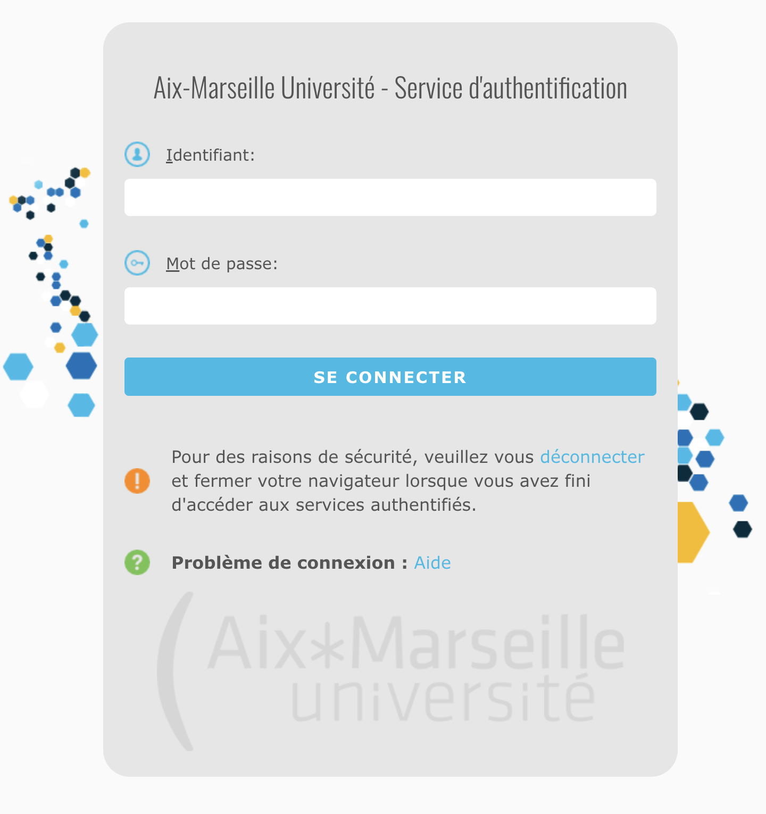

# Ametice Bot

## Introduction

Ametice Bot est un bot te permettant de télécharger en peu de temps tous les fichiers disponibles sur ton compte Ametice de façon ordonnée à l'aide
de ton identifiant et de ton mot de passe que tu saisis en temps normal sur cette page :

## Pourquoi Ametice Bot ?

Si tu en as marre de te rendre sur Ametice ou que tu veux tout simplement garder tous tes cours d'une année sur l'autre alors Ametice Bot est le programme qu'il te faut !

## Comment ça marche ?

Si tu veux l'utiliser alors tu as juste à exécuter le fichier *main.py* et à saisir tes identifiants. Les fichiers seront stockés dans des dossiers que le programme crée (de la forme *Fichiers Ametice/[annee_debut:annee_fin]/UE/chapitres/fichiers*).

## Et dans les autres régions ?

Si ton université utilise également moodle alors il suffit, dans le meilleur des cas, de modifier la méthode *login* de la classe AmeticeBot.
